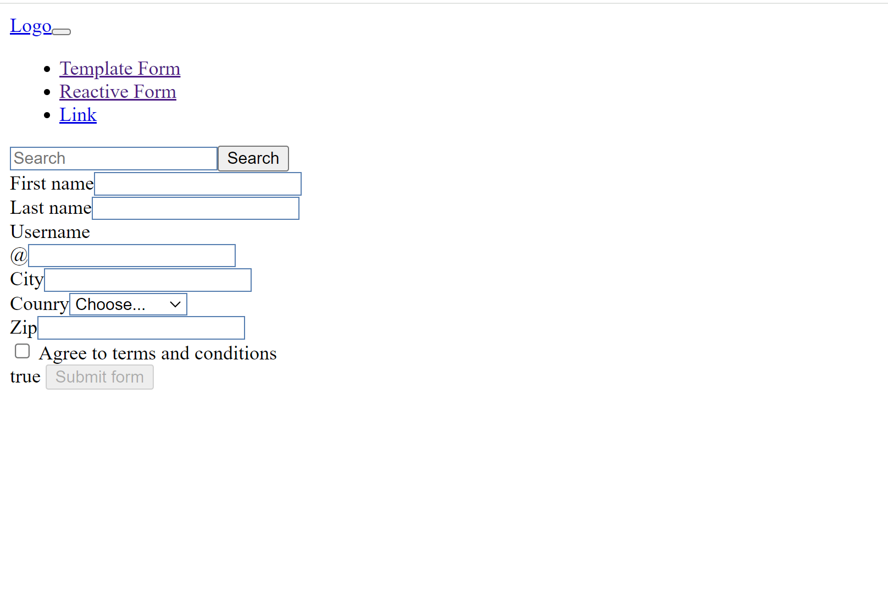
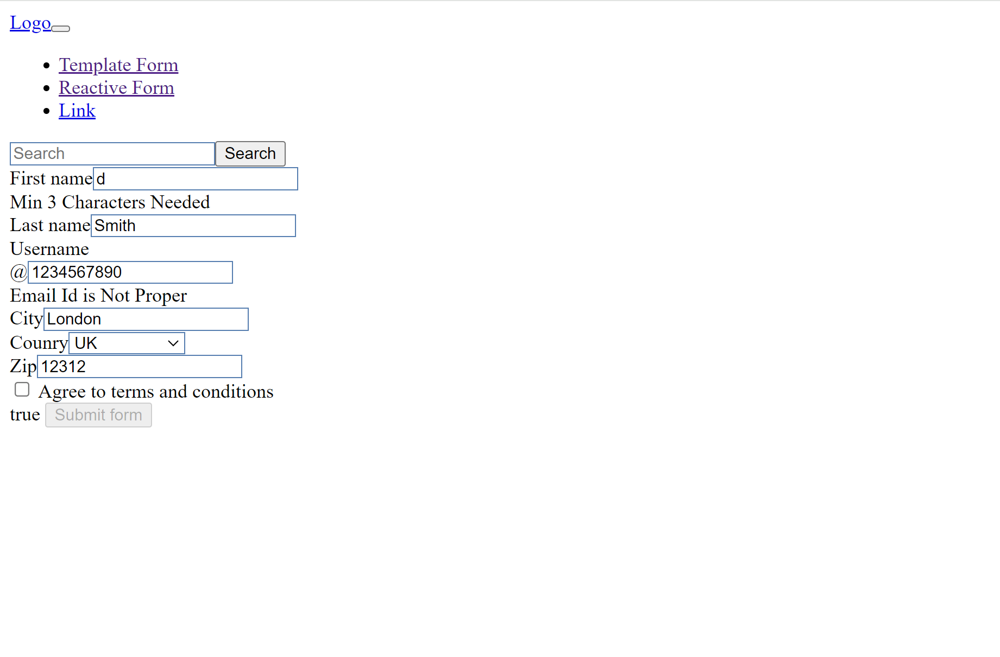
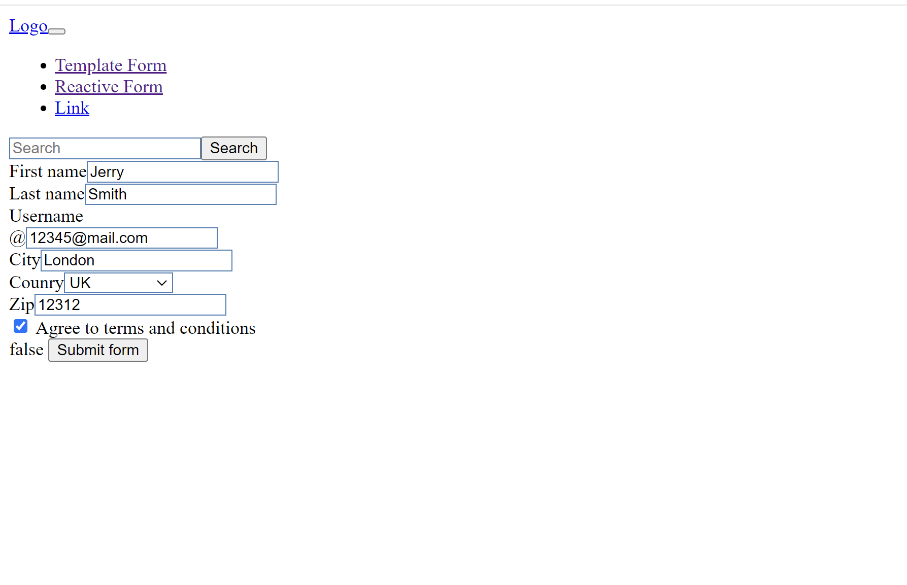

# TemplateFormAppWithAngular

This project was generated with [Angular CLI](https://github.com/angular/angular-cli) version 17.3.0.

## Development server

Run `ng serve` for a dev server. Navigate to `http://localhost:4200/`. The application will automatically reload if you change any of the source files.

## How to clone this repository?

- You can use the this command link for cloning the project files to your computer:

   git clone  https://github.com/ipekyilmaz35/Form-template-app-with-Angular.git

## Sample Screen Appearance

